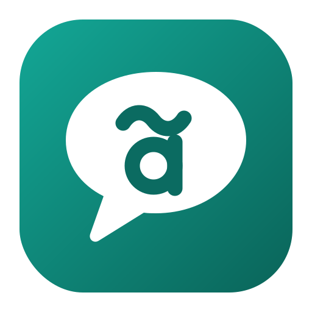

<p align="center"></p>

# Embromation

> **Embromation** (n.): *the ancient Brazilian art of pretending you speak
> English. This app ends it.*

Instant, private, on-device translation for macOS. Select text in any app,
hit a hotkey and watch the translation stream in. No cloud, no API keys,
no account.

- ⚡ First translated word in under a second (local LLM via MLX)
- 🔒 Nothing ever leaves your Mac. The only network call is the one-time model download
- 🎚️ Tone control (neutral / formal / casual) plus free-form instructions
- 🛡️ Glossary of protected terms: "deploy", "commit" and "pipeline" stay put
- 🌐 Auto-detected language pair: one hotkey translates both directions
- ⌨️ Keyboard end to end: ⌃T translates, ⌘C copies, ⌘⏎ replaces in place

## Install

1. Download the latest `Embromation-x.y.z.dmg` from
   [Releases](https://github.com/jaugustodafranca/embromation/releases).
2. Drag **Embromation** to Applications and launch it.
3. Follow the 3-step welcome guide (Accessibility permission + one-time
   ~2.3 GB model download).

The app is signed and notarized. It lives in your menu bar. Select text
anywhere and press **⌃T** to translate or **⌃G** to fix grammar.

**Status:** ✅ v1.0.0. See [CHANGELOG.md](CHANGELOG.md).

Requires macOS 14+ on Apple Silicon.

*Chega de embromation.* 🇧🇷

## Auditable by design

Privacy claims are cheap; code is not. Everything this app does is in this
repository. There is no server component, no telemetry, no analytics, no
account system, and no hidden network calls. The **only** connection the app
ever makes is downloading the translation model from Hugging Face, once.

This rule is enforced: see the privacy invariant
in [AGENTS.md](AGENTS.md). Changes that add network calls are rejected.
Don't take our word for it: audit the code, or build it yourself below.

## Build it yourself

You need macOS 14+ on Apple Silicon, Xcode 26+, and
[XcodeGen](https://github.com/yonaskolb/XcodeGen) (`brew install xcodegen`).

```bash
git clone https://github.com/jaugustodafranca/embromation.git
cd embromation
make test   # core test suite (fast, no model involved)
make run    # generates the Xcode project, builds and opens the app
```

Notes:

- The first build compiles the full MLX stack and takes several minutes.
  On a fresh machine run `xcodebuild -downloadComponent MetalToolchain` first.
- `project.yml` pins the maintainer's code-signing identity so macOS
  Accessibility permission survives rebuilds. To build your own copy, replace
  `DEVELOPMENT_TEAM` / `CODE_SIGN_IDENTITY` with your own identity, or set
  `CODE_SIGN_IDENTITY: "-"` for ad-hoc signing (works fine, but macOS will ask
  for the Accessibility permission again after every rebuild).

### Release secrets

None of these are needed to build or run locally. They are only used by the
release pipeline to produce a signed, notarized DMG. Set them as GitHub
Actions secrets in your fork if you want your own distributable build:

| Secret | What it is |
|---|---|
| `MAC_CERTIFICATE_P12_BASE64` | Your "Developer ID Application" certificate exported as .p12, base64-encoded |
| `MAC_CERTIFICATE_PASSWORD` | The password chosen when exporting the .p12 |
| `APPLE_ID` | The Apple ID email of your developer account |
| `APPLE_APP_SPECIFIC_PASSWORD` | An app-specific password from account.apple.com (for notarization) |
| `APPLE_TEAM_ID` | Your Apple Developer Team ID |

## Contributing

Found a bug, or an idea to make Embromation better? [Open an
issue](https://github.com/jaugustodafranca/embromation/issues/new/choose).
There are templates for both. For code contributions, please read
[CONTRIBUTING.md](CONTRIBUTING.md) first (short, promise), and note the hard
rules in [AGENTS.md](AGENTS.md): the privacy invariant is non-negotiable, the
core stays UI-free, and tests never load the real model.

## License

[MIT](LICENSE)
